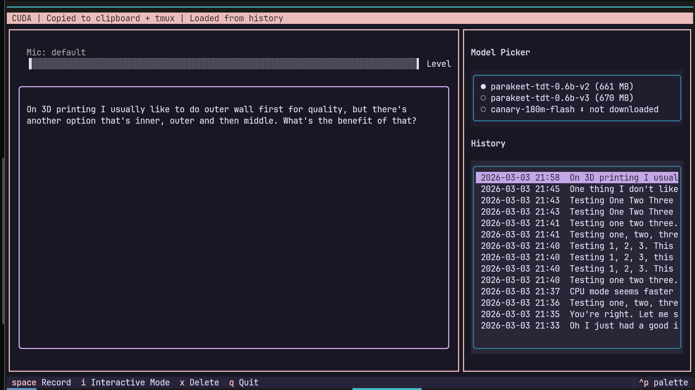

# Voice2Text

A terminal-based voice-to-text application with real-time transcription. Built with [Textual](https://textual.textualize.io/) and [onnx-asr](https://github.com/istupakov/onnx-asr).



## Features

- **100% Local & Offline** — All speech recognition runs on your machine. No audio leaves your computer, no cloud APIs, no accounts required. Models are open-source weights ([CC-BY-4.0](https://creativecommons.org/licenses/by/4.0/) / [MIT](https://opensource.org/licenses/MIT)) downloaded once from HuggingFace, then used entirely offline
- **Record & Transcribe** — Press SPACE to record from your microphone, SPACE again to stop and transcribe
- **Interactive Mode** — Press `i` to toggle real-time chunked transcription. Uses Silero VAD to detect speech/silence boundaries and transcribes segments as you speak, showing results incrementally
- **Multiple Models** — Ships with 3 built-in models, add more via `config.toml`
- **Model Management** — Download, switch, and delete models from the TUI. INT8 quantized ONNX models for fast CPU inference with optional CUDA acceleration
- **Clipboard Integration** — Transcriptions are automatically copied to your clipboard
- **Transcript History** — All transcriptions are saved to `./transcripts/` with timestamps, browsable and re-copyable from the sidebar

## Installation

Requires Python 3.11+.

```bash
git clone <repo-url> && cd voice2text
python -m venv .venv
source .venv/bin/activate
pip install -e .
```

### System Dependencies

**Audio recording** requires PortAudio:

| Platform | Command |
|---|---|
| Arch/CachyOS | `sudo pacman -S portaudio` |
| Ubuntu/Debian | `sudo apt install portaudio19-dev` |
| Fedora | `sudo dnf install portaudio-devel` |
| macOS | `brew install portaudio` |
| Windows | `choco install portaudio` or use prebuilt PyAudio wheels |

**Clipboard** (at least one recommended):

| Platform | Command | Notes |
|---|---|---|
| Wayland | `sudo pacman -S wl-clipboard` (or distro equivalent) | Integrates with KDE Klipper |
| X11 | `sudo pacman -S xclip` | or `xsel` |
| macOS | Built-in `pbcopy` | No install needed |
| Kitty terminal | Built-in `kitten clipboard` | No install needed |
| tmux | `tmux load-buffer -w` | Uses OSC 52 to reach system clipboard |

If no clipboard tool is available, falls back to OSC 52 escape sequences (supported by most modern terminals), then to file-only save.

## Usage

```bash
voice2text          # auto-detect CUDA/CPU
voice2text --cpu    # force CPU-only inference
```

### Keybindings

| Key | Action |
|---|---|
| `SPACE` | Start/stop recording |
| `i` | Toggle interactive mode (real-time chunked transcription) |
| `x` | Delete highlighted model or history entry |
| `q` | Quit |

### Workflow

1. Launch the app. It auto-detects CUDA/CPU and loads the last-used model.
2. Select a model from the picker on the right. If not downloaded, confirm to download.
3. Press SPACE to record. The level bar shows mic input in real-time.
4. Press SPACE again to stop. The audio is transcribed and copied to your clipboard.
5. Click any history entry to re-copy it.

### Interactive Mode

Press `i` to enable. When recording with interactive mode on:

- **Silero VAD** monitors your speech in real-time
- When you pause speaking (~1.5s silence), the audio segment is sent for transcription
- Results appear incrementally as you speak
- Press SPACE to stop — the final segment is transcribed, and the full text is saved and copied

The Silero VAD model (~2 MB) is auto-downloaded on first use.

## Built-in Models

| Model | Languages | INT8 Size | Notes |
|---|---|---|---|
| **parakeet-tdt-0.6b-v2** | English | ~640 MB | Best English accuracy |
| **parakeet-tdt-0.6b-v3** | 25 languages | ~640 MB | Multilingual |
| **canary-180m-flash** | EN/DE/FR/ES | ~214 MB | Smallest, includes translation |

All models are INT8 quantized ONNX from [istupakov's HuggingFace collection](https://huggingface.co/istupakov).

## Custom Models

Add models via `config.toml` in the project root. Copy `config.toml.example` to get started:

```bash
cp config.toml.example config.toml
```

Example — adding Whisper Base:

```toml
[[models]]
name = "whisper-base"
onnx_asr_name = "whisper-base"
description = "99+ Languages – OpenAI Whisper Base"
size_hint = "~107 MB"
repo_id = "istupakov/whisper-base-onnx"
```

### Config Fields

| Field | Required | Description |
|---|---|---|
| `name` | Yes | Display name in the picker |
| `onnx_asr_name` | Yes | Model identifier for `onnx_asr.load_model()` |
| `description` | No | Short description shown in download dialog |
| `size_hint` | No | Human-readable download size |
| `repo_id` | No | HuggingFace repo for downloading (defaults to `onnx_asr_name`) |
| `language` | No | Language code passed to `recognize()` (required for Canary models) |

### Compatible Models

Any model supported by [onnx-asr](https://github.com/istupakov/onnx-asr) works. Some options:

| Model | `onnx_asr_name` | `repo_id` | Languages | Size |
|---|---|---|---|---|
| Whisper Base | `whisper-base` | `istupakov/whisper-base-onnx` | 99+ | ~107 MB |
| Whisper Small | `onnx-community/whisper-small` | `onnx-community/whisper-small` | 99+ | ~460 MB |
| Canary 1B v2 | `nemo-canary-1b-v2` | `istupakov/canary-1b-v2-onnx` | 25 | ~1 GB |
| Canary 1B Flash | `istupakov/canary-1b-flash-onnx` | `istupakov/canary-1b-flash-onnx` | EN/DE/FR/ES | ~939 MB |
| Parakeet CTC 0.6B | `nemo-parakeet-ctc-0.6b` | `istupakov/parakeet-ctc-0.6b-onnx` | English | ~640 MB |

## Platform Compatibility

### Clipboard Support

| Platform | Method | Status |
|---|---|---|
| Linux Wayland + tmux | `wl-copy` + `tmux -w` | Works |
| Linux Wayland | `wl-copy` | Works |
| Linux X11 | `xclip` or `xsel` | Works |
| Linux Kitty | `kitten clipboard` or `wl-copy` | Works |
| macOS + tmux | `pbcopy` + `tmux -w` | Works |
| macOS | `pbcopy` | Works |
| Windows | Win32 API (built-in) | Works |
| Any terminal (fallback) | OSC 52 via `/dev/tty` or `CON` | Works in most modern terminals |

### Inference

| Backend | Status |
|---|---|
| CPU (all platforms) | Works |
| CUDA (NVIDIA GPU) | Auto-detected, falls back to CPU if unavailable |

Use `voice2text --cpu` to force CPU mode, useful for benchmarking or when CUDA causes issues.

### Tested On

- CachyOS (Arch-based), Python 3.14, Kitty + tmux, Wayland/KDE Plasma

## Project Structure

```
voice2text/
  app.py          — TUI layout, keybindings, recording/transcription flow
  models.py       — Model registry, download, load, inference via onnx-asr
  recorder.py     — PyAudio microphone recording, real-time level meter
  vad.py          — Silero VAD wrapper for interactive mode
  clipboard.py    — System clipboard + tmux buffer integration
  transcripts.py  — Save/load transcript .txt files
config.toml       — Custom model configuration (optional)
models/           — Downloaded model files
transcripts/      — Saved transcription history
tests/            — Pytest test suite
```

## Development

```bash
pip install -e .
pytest tests/test_app.py -v
```
